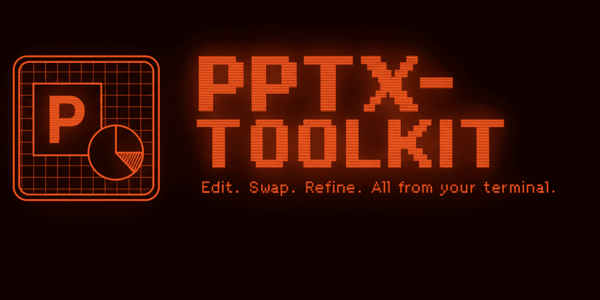

# PPTX-Toolkit



A lightweight, cross-platform Microsoft® PowerPoint manipulation toolkit. Swap color references (scheme colors and hex RGB values) in slides without modifying theme definitions.

## What it does

pptx-toolkit reads PowerPoint files and manipulates color references and layout metadata throughout slides, layouts, and masters. You can:

- Swap between **scheme colors** (like `accent1`, `accent5`) and **hex RGB values** (like `AABBCC`, `FF0000`)
- Inspect **slide layouts** — both name fields, master/theme relationships, and which slides use each layout

It supports atomic many-to-one color mappings and theme filtering, making it easy to rebrand presentations or fix specific hex colors across your deck.

## Installation

### Quick Install (Recommended)

```bash
# Install latest release
curl -sSL https://raw.githubusercontent.com/pmdci/pptx-toolkit/main/install.sh | bash
```

### Manual Build

```bash
git clone https://github.com/pmdci/pptx-toolkit
cd pptx-toolkit
make build
make install  # copies to ~/.local/bin
```

### Download Binary

Download pre-built binaries from the [releases page](https://github.com/pmdci/pptx-toolkit/releases).

Binaries are available for:

- **macOS**: ARM64, Intel (AMD64)
- **Linux**: ARM64, AMD64
- **Windows**: ARM64, AMD64

**macOS Users:** Downloaded binaries may be blocked by Gatekeeper. After downloading, run:

```bash
xattr -d com.apple.quarantine pptx-toolkit
```

Or alternatively:

```bash
codesign -s - pptx-toolkit
```

## Usage

### List themes and colors

View all themes and their color schemes in a PowerPoint file:

```bash
pptx-toolkit color list presentation.pptx
# or use UK spelling
pptx-toolkit colour list presentation.pptx
```

Example output:

```
Found 2 theme(s) in presentation.pptx:

━━━ theme1.xml ━━━
Theme:        Office Theme Deck
Color Scheme: Office

Colors:
  dk1      (Dark 1):              #000000
  lt1      (Light 1):             #FFFFFF
  accent1  (Accent 1):            #156082
  accent2  (Accent 2):            #E97132
  accent3  (Accent 3):            #196B24
  ...
```

### List slide layouts

Inspect all slide layouts in a PowerPoint file, including both name fields, the slide master and theme each layout belongs to, and which slides use it.

PowerPoint stores **two separate name fields** per layout, which can differ:

- **Name** (`p:cSld/@name`) — the layout name shown in Slide Master view
- **Matching Name** (`p:sldLayout/@matchingName`) — an optional name used in the New Slide / layout picker. Absent from layouts created by PowerPoint; present on layouts imported from other tools (e.g. Google Slides). When absent, PowerPoint falls back to **Name** in the picker too.

```bash
pptx-toolkit layout list presentation.pptx
```

Example output:

```
Found 34 layout(s) in presentation.pptx:

━━━ slideLayout1.xml ━━━
Layout ID:      slideLayout1
Name:           Title Slide
Matching Name:  <none>
Master:         slideMaster1.xml
Theme:          theme1.xml
Used By Slides: 1

━━━ slideLayout12.xml ━━━
Layout ID:      slideLayout12
Name:           matchName-test
Matching Name:  Layout with matchName property
Master:         slideMaster1.xml
Theme:          theme1.xml
Used By Slides: none
```

**Filters:**

```bash
# By layout file
pptx-toolkit layout list presentation.pptx --layout-id slideLayout4

# By Name (p:cSld/@name) — exact, case-sensitive
pptx-toolkit layout list presentation.pptx --name "Title Slide"

# By Matching Name (p:sldLayout/@matchingName) — exact, case-sensitive
pptx-toolkit layout list presentation.pptx --matching-name "Contacto + soher"

# By theme
pptx-toolkit layout list presentation.pptx --theme theme1
```

### Remove matching name from layouts

Remove the `matchingName` attribute (`p:sldLayout/@matchingName`) from slide layouts. Useful when importing from Google Slides or other tools that set this field and you want PowerPoint to fall back to using the standard **Name** field everywhere.

```bash
# Remove from all layouts
pptx-toolkit layout remove matching-name input.pptx output.pptx

# Remove from a specific layout
pptx-toolkit layout remove matching-name input.pptx output.pptx --layout-id slideLayout12

# Remove from layouts with a specific matching name
pptx-toolkit layout remove matching-name input.pptx output.pptx --matching-name "Contacto + soher"
```

Supports the same `--layout-id`, `--name`, `--matching-name`, and `--theme` filters as `layout list`.

### Swap color references

Replace color references throughout the presentation. Supports both scheme colors (e.g., `accent1`) and hex RGB values (e.g., `AABBCC`).

```bash
# Scheme to scheme
pptx-toolkit color swap accent1:accent3 input.pptx output.pptx

# Scheme to hex
pptx-toolkit color swap accent1:BBFFCC input.pptx output.pptx

# Hex to scheme
pptx-toolkit color swap AABBCC:accent2 input.pptx output.pptx

# Hex to hex
pptx-toolkit color swap FF0000:00FF00 input.pptx output.pptx

# Many-to-one mapping (atomic)
pptx-toolkit color swap "accent1:accent3,accent5:accent3" input.pptx output.pptx

# Mixed mappings (scheme + hex)
pptx-toolkit color swap "accent1:BBFFCC,000000:accent2,FF0000:00FF00" input.pptx output.pptx
```

Quotes are optional for simple mappings without spaces, but recommended when the mapping contains spaces or multiple comma-separated entries.

**Important:** Replacements are **atomic**, not cascading. In the example above:

- `accent1` becomes `accent3` (NOT `accent4`)
- `accent3` becomes `accent4`

#### Tint/shade handling

PowerPoint theme colors support tint and shade variants (lighter/darker versions). When swapping colors:

- **Scheme → Scheme**: Tint/shade modifiers are **preserved**

  ```bash
  # accent1 (80% lighter) becomes accent3 (80% lighter)
  pptx-toolkit color swap accent1:accent3 input.pptx output.pptx
  ```

- **Scheme → Hex**: Tint/shade modifiers are **stripped** (converted to base hex color)
  ```bash
  # accent1 (80% lighter) becomes FF00FF (base color, no tint)
  # accent1 (40% darker) also becomes FF00FF (base color, no tint)
  pptx-toolkit color swap accent1:FF00FF input.pptx output.pptx
  ```

This is semantically correct: literal RGB hex values don't support tint/shade variations. All theme color variants (base, lighter, darker) are replaced with the same hex color.

### Filter by theme

Only process specific themes when a PowerPoint file contains multiple themes. Works with both scheme and hex color mappings:

```bash
# Process only theme1
pptx-toolkit color swap accent1:accent3 input.pptx output.pptx --theme theme1

# Filter by theme with hex colors
pptx-toolkit color swap "accent1:BBFFCC,000000:accent2" input.pptx output.pptx --theme theme1

# Process multiple themes
pptx-toolkit color swap accent1:accent3 input.pptx output.pptx --theme theme1,theme2
```

### Scope filtering

Control whether color swaps apply to user content, master infrastructure, or both:

```bash
# Process everything (default behavior)
pptx-toolkit color swap accent1:accent3 input.pptx output.pptx

# Fix user overrides in content only (slides, charts, diagrams, notes)
pptx-toolkit color swap AABBCC:accent2 input.pptx output.pptx --scope content

# Update master template only (slideMasters, slideLayouts, notesMasters, handoutMasters)
pptx-toolkit color swap accent1:accent5 input.pptx output.pptx --scope master

# Combine scope and theme filtering
pptx-toolkit color swap accent1:accent3 input.pptx output.pptx --scope content --theme theme1
```

**Scope options:**

- `all` - Process all files (default)
- `content` - Process user content only (slides, charts, diagrams, notes)
- `master` - Process master infrastructure only (slideMasters, slideLayouts, notesMasters, handoutMasters)

### Slide filtering

Target specific slides for color swaps. Automatically includes embedded content (charts, diagrams, notes).

```bash
# Process specific slides
pptx-toolkit color swap accent1:accent3 input.pptx output.pptx --slides 1,3

# Process slide range
pptx-toolkit color swap accent1:accent3 input.pptx output.pptx --slides 5-8

# Combine ranges and individual slides
pptx-toolkit color swap accent1:accent3 input.pptx output.pptx --slides 1,3,5-8,10

# Combine with theme filtering
pptx-toolkit color swap accent1:accent3 input.pptx output.pptx --slides 1-5 --theme theme1
```

**Important:** `--slides` can only be used with `--scope content`.

**What gets processed:**

- Specified slide files
- Charts embedded in those slides (including colors.xml, style.xml)
- Diagrams/SmartArt in those slides (all 5 files: data, layout, colors, quickStyle, drawing)
- Presenter notes for those slides

### Valid color formats

**Scheme colors** (PowerPoint theme colors):

- **Text/Background**: `dk1`, `lt1`, `dk2`, `lt2`
- **Accents**: `accent1`, `accent2`, `accent3`, `accent4`, `accent5`, `accent6`
- **Hyperlinks**: `hlink`, `folHlink`

**Hex RGB colors**:

- 6-digit hex format (case-insensitive): `AABBCC`, `ff0000`, `00FF00`
- Do NOT include the `#` symbol

## Why pptx-toolkit?

Most PowerPoint manipulation tools require heavy dependencies like Python, .NET, or Office interop libraries. pptx-toolkit is a single binary with no dependencies that does one thing well: swap color references across your entire presentation while preserving document structure.

**Key features:**

- **Cross-platform**: Works on macOS, Linux, Windows (all ARM64/AMD64)
- **Atomic replacement**: Many-to-one mappings without cascading
- **Theme filtering**: Target specific themes in multi-theme presentations
- **Fast**: Instant startup, processes presentations in milliseconds
- **Lightweight**: Single binary (~2-5MB depending on platform)
- **No dependencies**: No Office, no Python, no runtime

**Use cases:**

- Rebrand presentations by swapping color schemes
- Replace hardcoded hex colors with theme colors for consistency
- Convert theme colors to specific hex values for brand compliance
- Unify color usage across multiple presentations
- Fix accidental color misuse in slide decks
- Automate presentation styling in CI/CD pipelines

## Development

```bash
make build         # Build optimised binary to bin/pptx-toolkit
make build-release # Build with maximum optimisation + UPX compression
make cross-compile # Build for all platforms (macOS/Linux/Windows on ARM64/AMD64)
make test          # Run all tests
make clean         # Clean build artifacts
make install       # Copy binary to ~/.local/bin
```

### Binary Size Optimisation

The build system includes several optimisations:

- **Compiler flags**: `-s -w -trimpath -extldflags=-Wl,--strip-all` remove debug symbols and build paths
- **UPX compression**: Automatically applied in `build-release` and `cross-compile` if UPX is installed
- **Cross-platform**: The Makefile handles UPX platform differences.
  - **macOS**: UPX compression is officially unsupported (Apple code signing issues)
  - **Windows ARM64**: UPX does not yet support Windows ARM64 PE format

Size comparison (typical results):

- Default Go build: ~5.4MB
- Optimised build: ~5.2MB
- With UPX (Linux/Windows AMD64): ~2.3MB (57% reduction)

## Contributing

Pull requests, bug reports, and feature suggestions are welcome!

Areas that could use help:

- Additional PowerPoint manipulation features (fonts, themes, etc.)
- Performance improvements for large presentations
- Additional output formats (JSON, YAML for color inspection)

## License

GPL-3.0-or-later. See LICENSE file for details.

Copyright (C) 2025 Pedro Innecco
